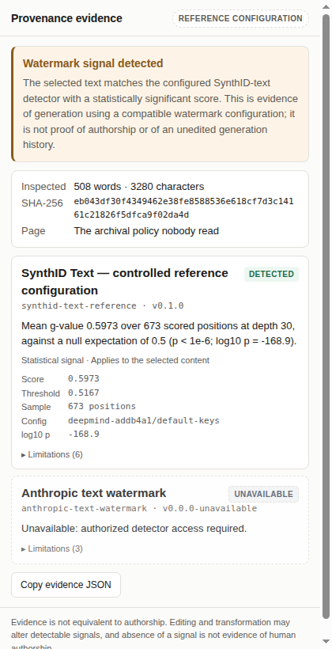

# Provenance Inspector

A Chrome extension that inspects selected web content for verifiable provenance signals and
reports the evidence it can establish — without pretending that absence of evidence proves
human authorship.



## What this is

Most "AI detectors" collapse weak statistical inference into a confident authorship verdict.
Provenance Inspector treats detection as an evidence problem instead: extract the content, run
every applicable detector, preserve each detector's evidence *and its limitations*, and present
the result without converting it into a judgement the evidence does not support.

Select a passage, right-click, choose **Inspect provenance**. A side panel reports what was
found, what it means, and what it does not mean.

The current build demonstrates controlled text-watermark detection and signed-asset
verification. Proprietary provider detectors can be added when authorized access is available.

**A reference implementation is available and running in Chrome.**

## What it does not do

This matters more than the feature list:

- It does **not** claim to detect production Gemini, ChatGPT, or Claude output. The SynthID
  detector runs against the *published demonstration keys*. A production deployment's keys are
  secret; without them, its watermark is invisible to this build.
- It contains **no** generic AI-writing classifier, and displays no "AI probability".
- A negative result is never presented as evidence of human authorship.
- An image's Content Credential is never allowed to vouch for the text around it.
- Unavailable provider integrations are listed as unavailable. Nothing is simulated.

## Install

```sh
npm install
npm run build          # -> dist/
```

Then in Chrome: `chrome://extensions` → enable **Developer mode** → **Load unpacked** →
select `dist/`. Requires Chrome 116 or later for the side panel API.

## Demo

```sh
node tools/build-fixtures.mjs        # regenerate text fixtures from the pinned record
node tools/build-fixture-page.mjs    # regenerate the demo article
```

Open `fixtures/page/article.html` in Chrome. Then:

| Do this | You should see |
| --- | --- |
| Select the whole watermarked passage → **Inspect provenance** | **Watermark signal detected**, score ≈ 0.606 against a threshold of ≈ 0.517 over 624 scored positions |
| Select the unwatermarked control passage | **No supported provenance signal detected** — and a note that this is not evidence of human authorship |
| Select one short sentence | **Not enough evidence** — never a negative |
| Right-click the signed image | **Valid Content Credential**, issuer `C2PA Test Signing Cert`, scoped to the asset |
| Right-click the tampered image | Credential present, did not validate — never rendered as verified |
| Right-click the unsigned image | No Content Credential found |

The extension holds no host permissions, so reading a page requires `activeTab` — which Chrome
grants only for the tab where you invoked the menu. For `file://` URLs, enable *Allow access to
file URLs* on the extension's details page, or serve the fixtures over HTTP.

## Architecture

```
apps/extension/          MV3 service worker, side panel
packages/evidence/       evidence model, digesting, reconciliation, registry, schema
packages/detectors/
  synthid-reference/     controlled SynthID-text detector (vendored scoring core)
  c2pa/                  Content Credential verification, in its own worker
  anthropic-status/      registered-but-unavailable capability
fixtures/                text, images, and the demo article
e2e/                     acceptance run against the built extension in real Chromium
```

A detector implements four things and is otherwise free:

```ts
interface Detector {
  readonly id: string; readonly name: string; readonly version: string;
  readonly evidenceKind: EvidenceKind;
  supports(input: InspectionInput): boolean;              // synchronous, side-effect free
  detect(input, context): Promise<Evidence[]>;
}
```

Expected lack of evidence is a **result**, not an exception. A detector that throws produces
`error` evidence and does not prevent the others from rendering. A detector that does not apply
produces nothing at all — because a text detector reporting "negative" about a JPEG would be a
false reassurance.

### Three decisions worth knowing about

**Selection is read under `activeTab`, not by a content script.** The context menu's
`info.selectionText` is truncated by Chrome at roughly 1KB, far below what a watermark detector
needs — the demo passage alone is 3,280 characters. So the live selection is read from the page
on demand. The extension therefore requests no host permissions and has no standing access to
any site.

**Detectors run in the side panel, not the service worker.** That is where the content is
displayed and where it dies when the panel closes, which makes the privacy claim simple. It is
also forced: C2PA verification needs WebAssembly and a worker, and an MV3 service worker can
host neither.

**C2PA runs in our own worker.** The maintained `@contentauth/c2pa-web` SDK will only load its
worker from an `https:` URL or an inline `blob:` URL. A Manifest V3 extension can offer neither:
its pages are served from `chrome-extension:` and its policy is fixed at
`script-src 'self' 'wasm-unsafe-eval'`. So `packages/detectors/c2pa/src/worker.ts` is the SDK's
worker layer rewritten to load from the extension's own origin. The verification engine beneath
it — `@contentauth/c2pa-wasm`, the same one the SDK drives — is unmodified.

### Evidence reconciliation

The aggregator never averages incompatible scores. Precedence decides which sentence *leads*:

1. cryptographically verified positive scoped to the inspected content
2. watermark positive scoped to the inspected content
3. verified positive scoped only to an associated asset
4. no positive evidence, with at least one detector having concluded
5. everything indeterminate, unavailable, or errored

Conflicting results stay visible. **A negative from one detector never cancels a positive from
another**, because they test different schemes.

## Honest limitations

- **The SynthID detector uses published demonstration keys** — the `DEFAULT_WATERMARKING_CONFIG`
  from `google-deepmind/synthid-text`. It detects text watermarked with *those* keys. It is a
  proof of the pipeline, not a production capability, and the UI says so on every result.
- **The scoring statistic is the mean g-value**, not the learned Bayesian detector the paper and
  the reference repository use for their headline numbers. It is weaker, and reported as such.
- **Tokenization is pinned to GPT-2.** Text generated with a different tokenizer will not line
  up regardless of watermark configuration.
- **The closed-form p-value assumes independent g-values**, which rests on the hash behaving
  like a pseudorandom function. The reference implementation's own README states its hash offers
  no cryptographic guarantees. The significance threshold is set at 1e-6 rather than a
  conventional 0.05 to buy margin against that gap.
- **The demo passage is 476 words**, not the 800–1,500 the product brief imagines, because the
  pinned generation record contains 320-token samples. Longer fixtures need a local generation
  run — see [`fixtures/generated/README.md`](fixtures/generated/README.md), which is wired so
  that dropping the record in place re-points the fixtures and the tests with no code edits.
  GPT-2's 1,024-token context caps a single continuation near 760 words, so more than that means
  concatenating several samples.
- **C2PA validation reports `Valid`, not `Trusted`.** The signature verifies; no trust list is
  consulted. Anyone can sign an asset with a certificate they generated themselves, and the
  panel says so.
- **Images must be re-fetchable by the page.** A cross-origin image served without permissive
  CORS headers cannot be read under `activeTab`, and is reported as such rather than worked
  around.

## Tests

```sh
npm test          # 235 unit and integration tests
npm run typecheck
```

Test coverage maps onto the claims:

- `packages/detectors/synthid-reference/vendor/**` — 174 **differential** tests whose
  expectations were generated by the Python reference implementation, not by the TypeScript
  under test. These are what make the port's fidelity checkable rather than asserted. They are
  vendored unmodified; see that directory's `README.md`.
- `packages/evidence` — reconciliation precedence, conflict preservation, failure containment,
  digest determinism, schema validation.
- `packages/detectors/*/src` — the editorial calls: indeterminate-not-negative, no false
  positive at threshold, scope discipline, and that no result ever claims authorship.
- `fixtures/fixtures.test.ts` — the fixture matrix against the checked-in files, plus a
  differential check that our mean g-value reproduces the Python reference implementation's own
  score for the same sample (currently within 0.0007), and a digest check that no fixture has
  been edited by hand.

### End-to-end

```sh
npm run build
npm i -D playwright && npx playwright install chromium
node e2e/verify.mjs
```

Loads the built extension into real Chromium and asserts the 16 things unit tests cannot see —
that the MV3 policy actually permits the C2PA worker and its WebAssembly, that a 3,280-character
selection survives the trip to the panel, and that the rendered panel never displays an
AI-generated verdict or a probability. It writes `docs/screenshots/`, so the screenshots in this
README are reproducible from checked-in fixtures rather than staged.

## Credits

The SynthID scoring core is vendored from
[`crypto-lab-token-tell`](https://github.com/systemslibrarian/crypto-lab-token-tell) (MIT), itself
a port of [`google-deepmind/synthid-text`](https://github.com/google-deepmind/synthid-text).
Content Credential verification uses `@contentauth/c2pa-wasm` from the Content Authenticity
Initiative. C2PA image fixtures are published test assets from `contentauth/c2pa-js`. See
[THIRD_PARTY_NOTICES.md](THIRD_PARTY_NOTICES.md).

## Open questions

The browser artifact is the small end of a larger problem:

- How should provenance claims survive composition, when a page draws on several origins?
- What scope should a claim retain after summarization, quotation, translation, or OCR?
- How does a consumer combine cryptographic, watermark, metadata, and heuristic evidence without
  manufacturing false precision?
- How can a trusted component avoid laundering an untrusted claim while transforming content?
- What is the smallest interoperable evidence vocabulary that still preserves issuer, scope,
  transformation history, uncertainty, and detector provenance?
- Which interface language actually helps a non-specialist tell "no signal" from "evidence of
  absence"?

## License

MIT — see [LICENSE](LICENSE).
